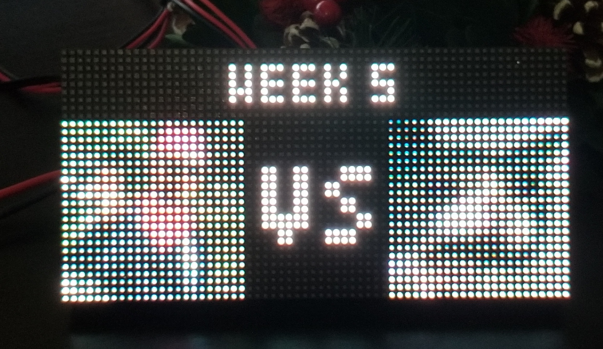
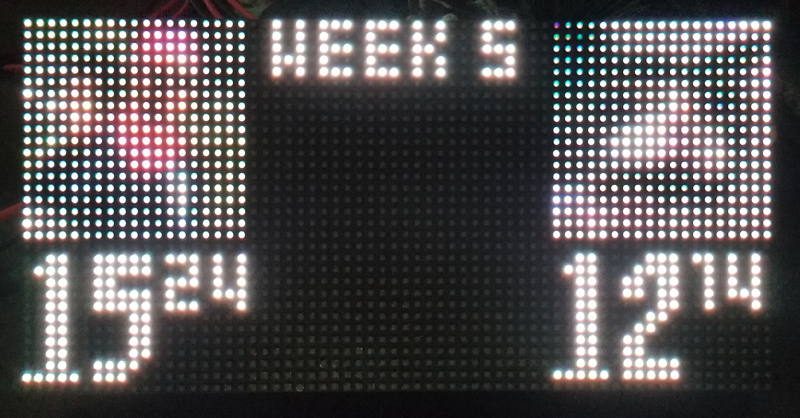
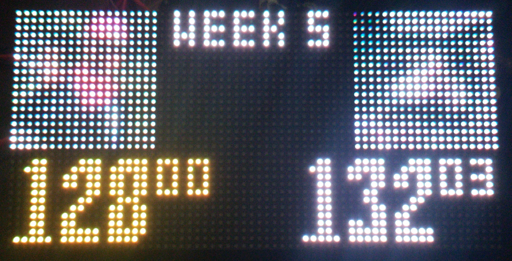
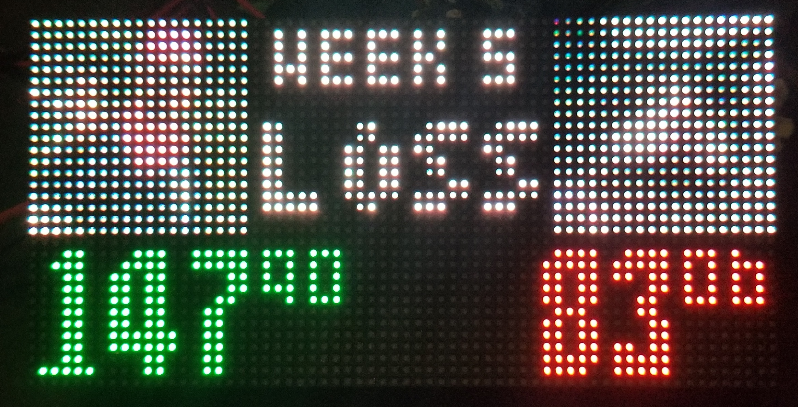
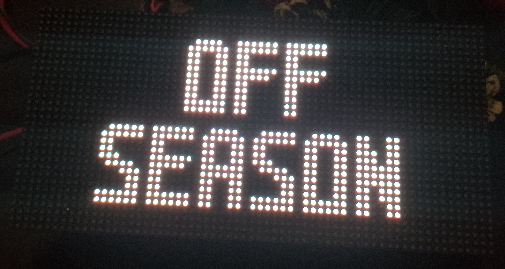

# fantasy-football-scoreboard


Display your favourite fantasy football team score on an raspberry pi powered LED matrix. Currently supports 64x32 boards only, and the Sleeper fantasy platform.

### Credit and inpsiration
This project was inspired by the [nhl-led-scoreboard](https://github.com/riffnshred/nhl-led-scoreboard), who based THEIR project off of the [mlb-led-scoreboard](https://github.com/MLB-LED-Scoreboard/mlb-led-scoreboard). Go check them out, and start watching hockey if you don't already (and baseball too but I love hockey more (go Leafs!)).

## Features (v0.0.2)

### Pregame
Currently shows your opponent's avatar, and their name (if it's 12 characters or less, otherwise it won't fit, see the picture at the top of the README).  Hoping to incorporate projections in future releases.

### Live scoring updates 
Starting at ~8pm Eastern Thursday, the score will be updated every 10s until about ~1am Eastern Tuesday.  The colours will change red if a score goes down, and green if a score goes up.  There is also a "big play" notifier of when a team's score goes up by more than 5 points, because that's exciting. The team's score will go gold to show who got the big play. 

Here's a gif that shows you what this would look like (excuse the shaky hands please, I was updating my testing REST API with one hand and filming with the other). 

I plan to set this so that it only does these checks during actual game times, because there's no real point in checking for game updates on non-game days or during non-game times on gamedays. Eventually, I'd like to only check for score updates if there's a player in the matchup who's playing (v1.0.0 release).

### Postgame
The board will stay in a post-game state until the next week, and will easily disappoint you with a quick glance. Loser is red, winner is green, with LOSS or WIN in between for that extra oomph. 

### Off season
It displays a message that it's the off season.  You should just turn it off and plan to be heartbroken again next year.

## Roadmap

Future plans include:
* using different platforms (Yahoo first and then ESPN most likely (if at all possible))
* more efficient score checking (currently hits the Sleeper API once a second from Thursday, 8:15pm Eastern until Tuesday, 1am Eastern. Not ideal.)
* cycle through league scores on off-game times during the week (Post game could cycle through each matchup's result)
* finding a better way to set the opening day than a config option (but it's only set once a year so this is pretty low prio)
* different animations for good plays vs bad plays (nobody wants to see "BIG PLAY" and then see it's your opponent getting the points)
* cycle through multiple teams in multiple leagues so you don't just have to pick your favourite team (although we all have one best league)
* maybe some fun stuff for the draft like who just drafted whom and a countdown clock or something I don't know but it'll be flashy (can't do this yet with current sleeper api)
* analyze your team weaknesses and help with waiver pickups (will not do this)

## Installation
### Hardware Assembly
The [mlb-led-scoreboard guys made a great wiki page to cover the hardware part of the project](https://github.com/MLB-LED-Scoreboard/mlb-led-scoreboard/wiki). There's also this [very handy howchoo page](https://howchoo.com/g/otvjnwy4mji/diy-raspberry-pi-nhl-scoreboard-led-panel) which is what I mainly followed.

### Software Installation
#### Raspbian Distribution
It is recommended you install the Lite version of Raspbian from the [Raspbian Downloads Page](https://www.raspberrypi.org/downloads/raspbian/). This version lacks a GUI, allowing your Pi to dedicate more system resources to drawing the screen.

#### Requirements
You need Git for cloning this repo and PIP for installing the scoreboard software.
```
sudo apt-get update
sudo apt-get install git python-pip
```

#### Installing the software
This installation process might take some time because it will install all the dependencies listed below.

```
git clone --recursive https://github.com/mikemountain/fantasy-football-scoreboard
cd fantasy-football-scoreboard/
sudo chmod +x install.sh
sudo ./install.sh
```
[rpi-rgb-led-matrix](https://github.com/hzeller/rpi-rgb-led-matrix/tree/master/bindings/python#building): The open-source library that allows the Raspberry Pi to render on the LED matrix.

[requests](https://requests.kennethreitz.org/en/master/): To call the API and manipulate the received data.

## Testing & Optimization (IMPORTANT)
If you have used a LED matrix on a raspberry pi before and know how to run it properly, then you can skip this part. 

If you just bought your LED matrix and want to run this software right away, reference the [rpi-rgb-led-matrix library](https://github.com/hzeller/rpi-rgb-led-matrix/). Check out the section that uses the python bindings and run some of their examples on your screen. For sure you will face some issues at first, but don't worry, more than likely there's a solution you can find in their troubleshooting section.
Once you found out how to make it run smoothly, come back here and do what's next.

### Adafruit HAT/bonnet
If you are using any thing from raspberry pi 3+ to the newest versions with an Adafruit HAT or Bonnet, here's what [RiffnShred](https://github.com/riffnshred) did to run his board properly. It seems these are more recommendations than things you 100% absolutely need to do, but are probably beneficial anyway.

* Do the hardware mod found in the [Improving flicker section ](https://github.com/hzeller/rpi-rgb-led-matrix#improving-flicker).
* Disable the on-board sound. You can find how to do it from the [Troubleshooting sections](https://github.com/hzeller/rpi-rgb-led-matrix#troubleshooting)
* From the same section, run the command that remove the bluetooth firmware, unless you use any bluetooth device with your pi.

Finally, here's the command he used.
```
sudo python main.py --led-gpio-mapping=adafruit-hat-pwm --led-brightness=60 --led-slowdown-gpio=2
```

## Usage
Open the config.json file from the root folder and change these values:

* ```league_id``` - this value can be found in the Sleeper URL: ```https://sleeper.app/leagues/<league_id>/team```
* ```user_id``` - I feel like there has to be an easier way to find this info, but right now I run this command ```curl https://api.sleeper.app/v1/league/<league_id>/users | jq '.[] | select(.display_name=="<your_sleeper_username>") | .user_id'```. Obviously make sure to swap in your league_id and Sleeper username
* ```opening_day``` - there will probably be a better way to get this info but meh, you have to change it once a year. Set it year, month, date format with dashes: 2019-09-05. Make sure it's the Thursday, the NFL Kickoff Game, the date the first game is on!

Now, in a terminal, cd to the fantasy-football-scoreboard folder and run this command. 
```
sudo python main.py 
```
**If you run your screen on an Adafruit HAT or Bonnet, you need to supply this flag.**
```
sudo python main.py --led-gpio-mapping=adafruit-hat
```

### Flags
Use the same flags used in the [rpi-rgb-led-matrix](https://github.com/hzeller/rpi-rgb-led-matrix/) library to configure your screen.
```
--led-rows                Display rows. 16 for 16x32, 32 for 32x32. (Default: 32)
--led-cols                Panel columns. Typically 32 or 64. (Default: 32)
--led-chain               Daisy-chained boards. (Default: 1)
--led-parallel            For Plus-models or RPi2: parallel chains. 1..3. (Default: 1)
--led-pwm-bits            Bits used for PWM. Range 1..11. (Default: 11)
--led-brightness          Sets brightness level. Range: 1..100. (Default: 100)
--led-gpio-mapping        Hardware Mapping: regular, adafruit-hat, adafruit-hat-pwm
--led-scan-mode           Progressive or interlaced scan. 0 = Progressive, 1 = Interlaced. (Default: 1)
--led-pwm-lsb-nanosecond  Base time-unit for the on-time in the lowest significant bit in nanoseconds. (Default: 130)
--led-show-refresh        Shows the current refresh rate of the LED panel.
--led-slowdown-gpio       Slow down writing to GPIO. Range: 0..4. (Default: 1)
--led-no-hardware-pulse   Don't use hardware pin-pulse generation.
--led-rgb-sequence        Switch if your matrix has led colors swapped. (Default: RGB)
--led-pixel-mapper        Apply pixel mappers. e.g Rotate:90, U-mapper
--led-row-addr-type       0 = default; 1 = AB-addressed panels. (Default: 0)
--led-multiplexing        Multiplexing type: 0 = direct; 1 = strip; 2 = checker; 3 = spiral; 4 = Z-strip; 5 = ZnMirrorZStripe; 6 = coreman; 7 = Kaler2Scan; 8 = ZStripeUneven. (Default: 0)
```
There are also flags to set your sleeper league ID and fantasy team ID to use instead of what's in the config (to show other people their teams quickly, for example)
```
--league-id              Set your sleeper league ID
--team-id                Set your fantasy team ID
```

## Licensing
This project uses the GNU General Public License v3.0. If you intend to sell these, the code must remain open source and you at least have to tell your leaguemates how cool I am (please, I need this).

